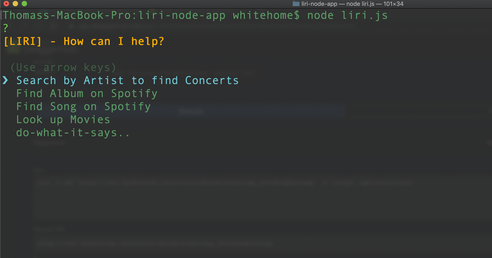
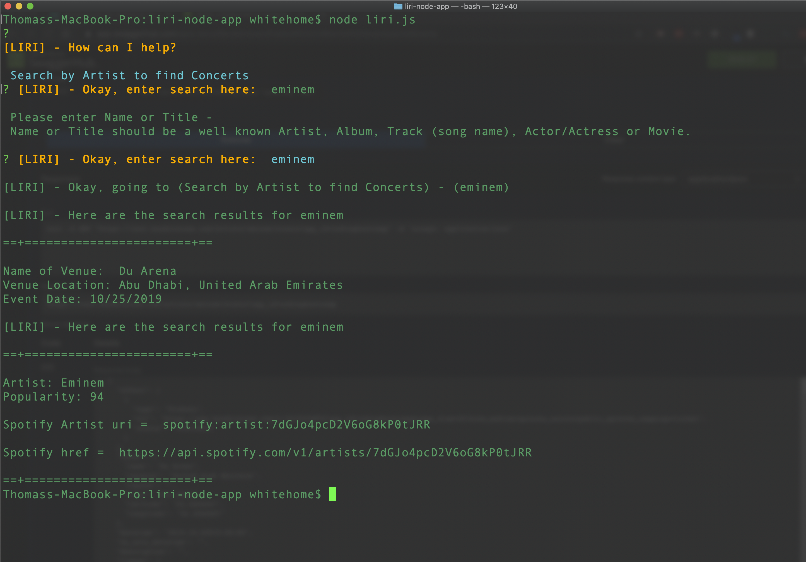
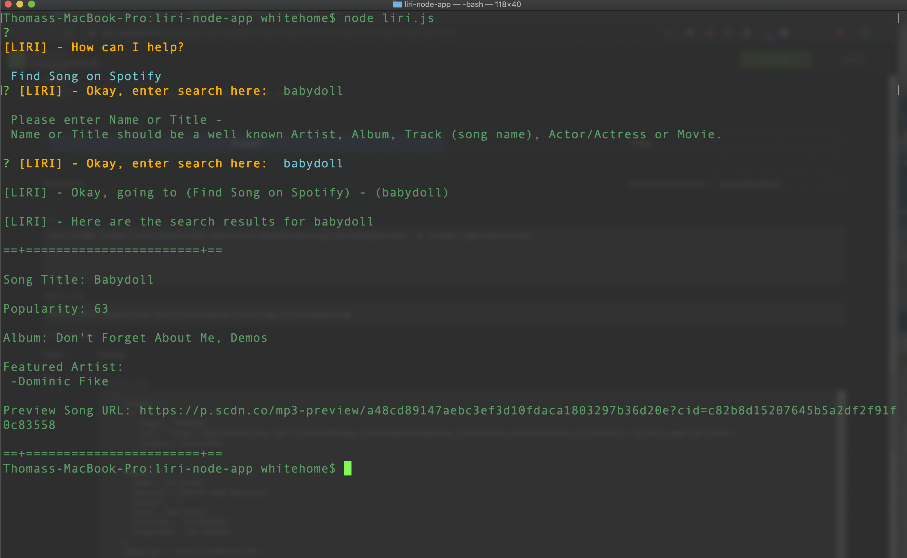
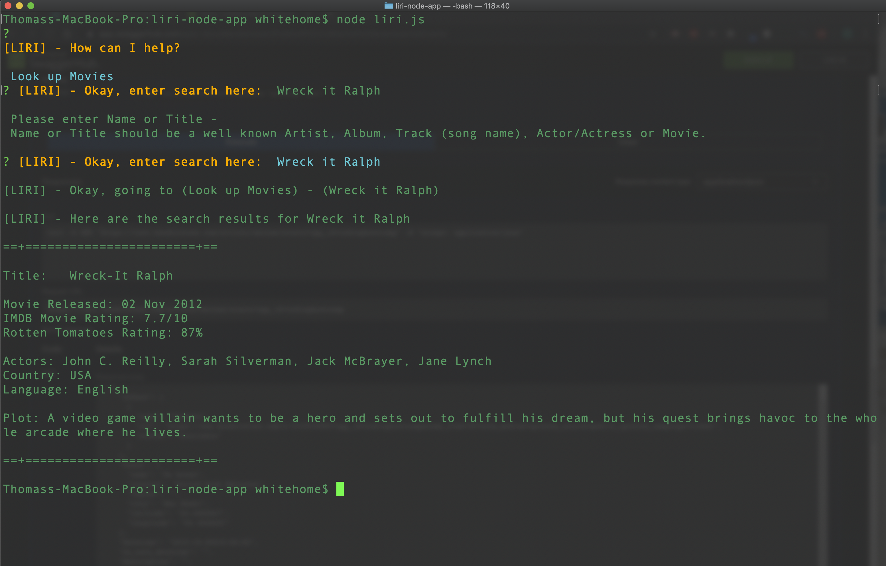

# liri-node-app

### LIRI is a _Language_ Interpretation and Recognition Interface. A command line node app that takes in parameters and gives you back data.

### LIRI uses Node Package Manger to install Node-Spotify-API, Moment, DotEnv, and Axios packages.

 npm install packages:
   1. dotenv
   2. moment
   3. axios
   4. node-spotify-api
   5. inquirer

#### Inquirer Question Prompt

#### Find Concert by Artist -

#### Find Album -

#### Find Song -

#### Search for Movies and Actors

