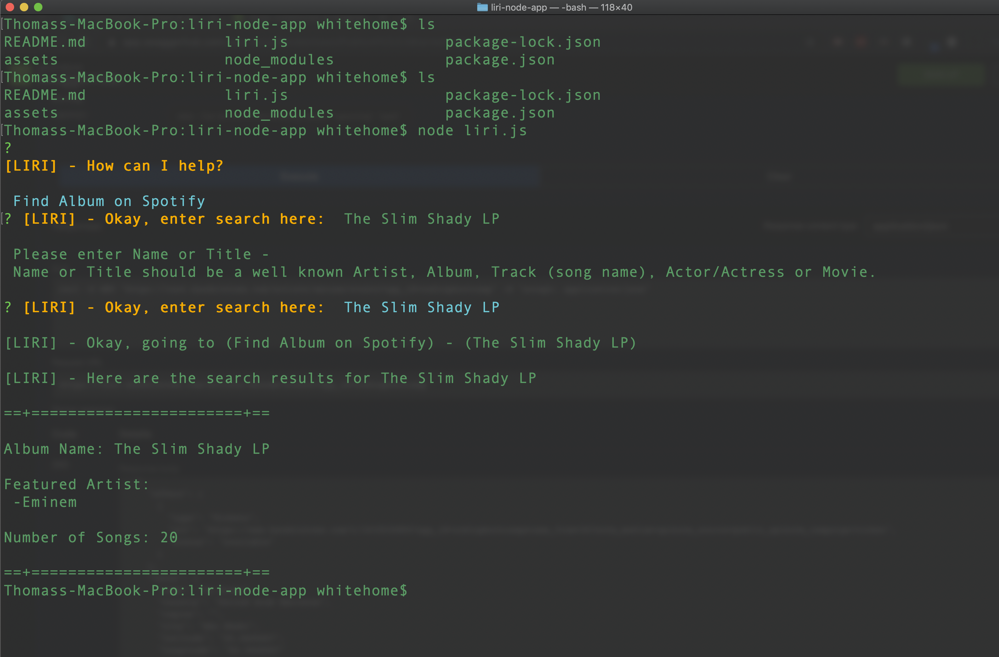

# liri-node-app

## LIRI is a _Language_ Interpretation and Recognition Interface. A command line node app that takes in parameters and gives you back data.

## Project Use Case 

### This project aims to use node packages for GET request to several API's. LIRI also intends to demonstrate using the node package manager for deploying projects easily.


### Node Packages Used: 
  - **Axios** - node package for performing get requests to OMDB API, and the Bands in Town API.
  - **Node-Spotify-Api** - node package for getting music information from Spotify's API
  - **Momemnt.js** - Converts timedata. Used for displaying upcoming concert dates in MM/DD/YYYY format
  - **DotEnv.js** - Hides Passwords (user must supply their own spotify api keys, descripted below)
  - **Inquirer** - Prompts user with questions. Used attaining better search results with less errros, and for a cleaner user experience.

### **[Project Link](https://github.com/thomas-white-ucf/liri-node-app)**


## Project deployment

1. Download full liri-node-app. Located at above project link.
2. User must have current supported version of node.js installed on users computer.
3. LIRI requires users to install several node packages as dependencies. User can accomplish this by going to LIRI's file location in command line/terminal and entering the following command: 
    ```
    npm install
    ```
    *This will install all of the following node packages*
   - dotenv
   - moment
   - axios
   - node-spotify-api
   - inquirer

4. Next, create a file named `.env`, add the following to it, replacing the values with your API keys (\```no quotes```)
     ```
     # Spotify API keys
     SPOTIFY_ID=your-spotify-id
     SPOTIFY_SECRET=your-spotify-secret
     ```
5. LIRI is ready to run!  Usage instructions below..  `node liri.js`!


## Usage Instructions

1. Go to liri-node-app file location in terminal or command line. Run LIRI with node:
    ```
        node liri.js
    ```
2. If installed correctly, once you run enter `node liri.js`, you will be prompted with a question (*shown in picture below*). User must select one of the options using their arrow keys and pressing enter.
3. User will then be able to type, and enter, the name of what they are searching for.
  - **Option 1-3 Selected:** User then will be given option to enter a name of Artist, Album or Song to search if they selected one of the first 3 options
  - **Find Movie/Actor Selected** If user selected Look up movies, they may enter the name of either a movie, actor, or actress.

## LIRI Search Examples

#### Inquirer Question Prompt

#### Find Concert by Artist -

#### Find Album -

#### Find Song -

#### Search for Movies and Actors


## Development Notes:
1. 
2.
3. 


- Thomas White
- UCF Coding Bootcamp
